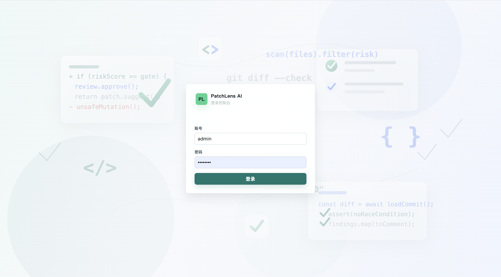
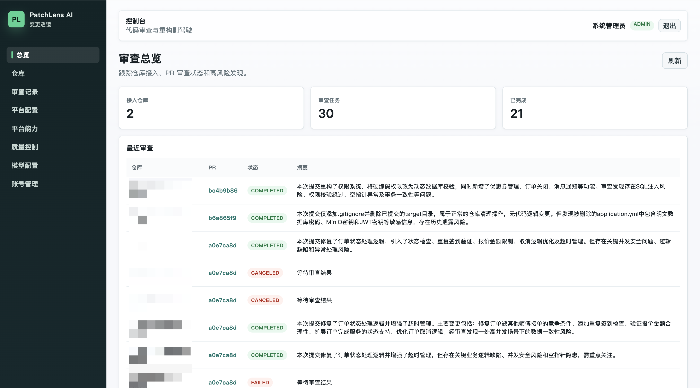
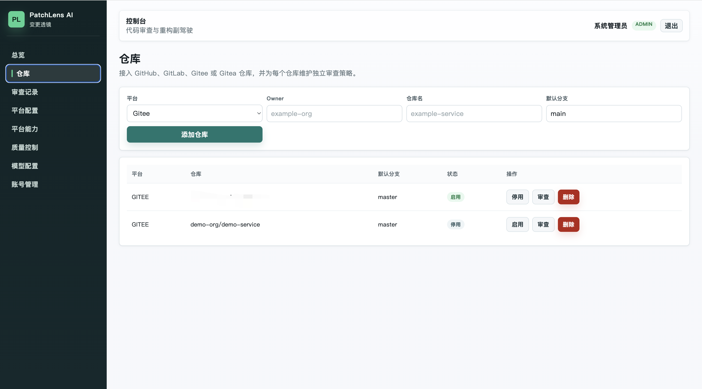
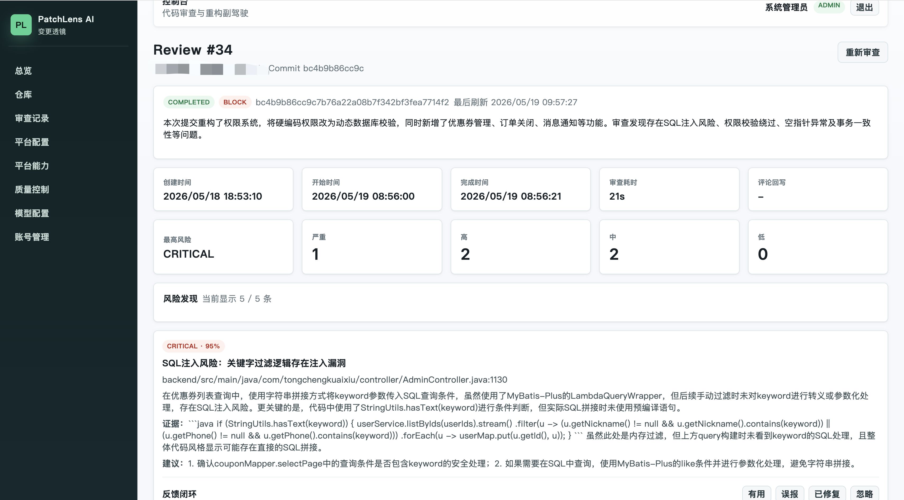
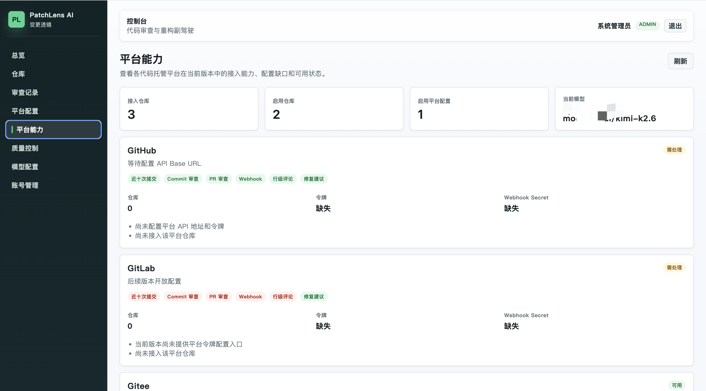
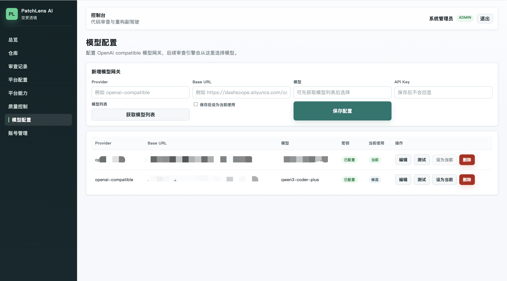
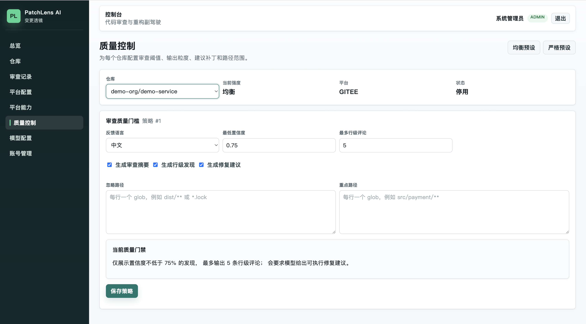

# PatchLens AI

[](LICENSE)


PatchLens AI（变更透镜）是一个面向 PR / commit 的 AI 代码审查副驾驶。它会在团队成员提交代码后，自动生成审查摘要，识别高风险变更，并给出可执行的修复建议。

面向正在引入 AI 开发流程的团队，PatchLens AI 希望把“代码写得更快”之后紧跟着出现的“谁来更快、更稳地审”这件事接住。  
它适合本地试用、团队内测、平台集成验证，也适合作为开源基础项目继续扩展成更完整的 AI 代码审查平台。

> Status: Alpha / Developer Preview.  
> 当前版本适合本地试用、团队内测和二次开发，不建议直接作为生产级强制门禁系统使用。

## 核心能力

- AI 审查：支持 commit 审查、PR webhook 审查、异步任务执行和审查记录分页。
- 平台集成：支持 GitHub、Gitee、Gitea 的仓库接入、分支提交查询、PR 上下文拉取和总结评论回写。
- 模型网关：支持多个 OpenAI compatible 模型配置，支持获取模型列表、连接测试和启用切换。
- 质量控制：支持仓库级质量策略、Prompt 控制、路径过滤、置信度过滤、PASS / WARN / BLOCK 结论。
- 安全基础：登录、账号管理、密钥加密、Webhook secret 校验、审计日志。
- 反馈闭环：支持对风险发现标记有用、误报、已修复、忽略，为后续团队规则学习打基础。

## 平台能力矩阵

| 能力 | GitHub | Gitee | Gitea |
| --- | --- | --- | --- |
| 仓库接入 | Yes | Yes | Yes |
| 分支列表 | Yes | Yes | Yes |
| 分支 + 提交人查询 | Yes | Yes | Yes |
| Commit 审查 | Yes | Yes | Yes |
| PR webhook 审查 | Yes | Yes | Yes |
| PR 总结评论回写 | Yes | Yes | Yes |
| 行级精准评论 | Planned | Planned | Planned |

## 开源说明

本项目使用 Apache License 2.0。参与贡献前请阅读：

- [CONTRIBUTING.md](CONTRIBUTING.md)
- [SECURITY.md](SECURITY.md)
- [CODE_OF_CONDUCT.md](CODE_OF_CONDUCT.md)
- [Open Source Release Checklist](docs/OPEN_SOURCE_CHECKLIST.md)

## 界面预览

以下截图建议统一存放在 `docs/screenshots/`，方便 README 和发布页复用。

### 登录页

管理员登录入口，适合本地试用、团队内测和演示环境快速进入控制台。



### 审查总览

用于查看接入仓库数量、审查任务状态和最近一次审查摘要，适合作为控制台首页。



### 仓库页

用于接入 GitHub、Gitee、Gitea 仓库，并管理默认分支、启停状态和手动审查入口。



### 审查详情

用于查看一次审查任务的摘要、风险分布、逐条发现、修复建议以及反馈闭环状态。



### 平台能力

用于查看各代码托管平台在当前版本中的接入能力、配置缺口和可用状态。



### 模型配置

用于配置 OpenAI compatible 模型网关、获取模型列表、切换当前生效模型并做连通性测试。



### 质量控制

用于配置仓库级审查策略，包括输出语言、最低置信度、最大行级评论数、修复建议开关和路径过滤范围。



## 快速体验流程

如果你想用最短路径把 PatchLens AI 跑起来，可以按下面的顺序体验：

1. 复制环境变量模板并启动基础服务：

```bash
cp .env.example .env
docker compose up --build
```

2. 打开控制台并登录：

```text
http://localhost:5173
admin / patchlens-admin
```

3. 在 `平台配置` 中配置 GitHub、Gitee 或 Gitea 的 API 地址、访问令牌和 Webhook secret。

4. 在 `模型配置` 中新增一个 OpenAI compatible 模型网关，获取模型列表后设为当前使用模型。

5. 在 `仓库` 中接入目标仓库，然后发起一次 commit 审查，或配置 webhook 让 PR 自动进入审查流程。

6. 在 `审查详情` 中查看摘要、风险发现、修复建议和反馈闭环结果，再到 `质量控制` 中调整阈值和输出粒度。

## 技术栈

- Backend: Java 17, Spring Boot 3.5.7, Spring AI 1.1.6, Spring Data JPA, Flyway
- Frontend: Vue 3, Vite, TypeScript, Pinia, Vue Router
- Storage: PostgreSQL + pgvector, Redis（使用本地已有 Redis）

## 项目结构

第一次进入仓库时，建议先从下面这些位置开始看：

```text
.
├── backend/
│   ├── src/main/java/com/patchlens/   Spring Boot 后端主代码，包含 API、审查服务、Webhook 和平台集成
│   ├── src/main/resources/
│   │   ├── application.yml            后端默认配置
│   │   └── db/migration/              Flyway 数据库迁移脚本
│   ├── src/test/java/                 后端测试代码
│   ├── pom.xml                        Maven 构建入口
│   └── Dockerfile                     后端镜像构建文件
├── frontend/
│   ├── src/views/                     控制台页面，包含仓库、审查详情、模型配置、质量控制等页面
│   ├── src/api/                       前端 API 请求封装与类型定义
│   ├── src/router/                    路由配置
│   ├── package.json                   前端依赖与脚本入口
│   └── Dockerfile                     前端镜像构建文件
├── docs/
│   ├── patchlens-requirements.md      产品需求与路线背景
│   ├── OPEN_SOURCE_CHECKLIST.md       开源发布前检查清单
│   └── screenshots/                   README 和发布页使用的界面截图
├── .github/                           GitHub Actions 与 issue / PR 模板
├── docker-compose.yml                 本地一键启动所需的 PostgreSQL、后端、前端编排
├── .env.example                       本地或部署环境变量模板
├── CONTRIBUTING.md                    贡献指南
└── README.md                          项目说明、快速体验流程和路线图
```

## 从哪里开始读代码

如果你是第一次看 PatchLens AI，通常可以按下面的顺序进入：

- 想看“一次审查任务是怎么跑完的”，先看 [backend/src/main/java/com/patchlens/service/ReviewExecutionService.java](backend/src/main/java/com/patchlens/service/ReviewExecutionService.java)。
- 想看后端 API 和控制台如何对接，先看 [backend/src/main/java/com/patchlens/api/](backend/src/main/java/com/patchlens/api/) 和 [frontend/src/api/client.ts](frontend/src/api/client.ts)。
- 想看前端页面结构，先看 [frontend/src/views/](frontend/src/views/)；其中 `RepositoriesView.vue`、`ReviewsView.vue`、`ReviewDetailView.vue` 是主流程入口。
- 想看 GitHub、Gitee、Gitea 怎么接进来，先看 [backend/src/main/java/com/patchlens/webhook/](backend/src/main/java/com/patchlens/webhook/) 和 [backend/src/main/java/com/patchlens/service/](backend/src/main/java/com/patchlens/service/) 下的 `*PullRequestClient` 实现。
- 想看质量策略和评论筛选逻辑，先看 [frontend/src/views/QualityControlView.vue](frontend/src/views/QualityControlView.vue)、[backend/src/main/java/com/patchlens/service/ReviewPolicyApplier.java](backend/src/main/java/com/patchlens/service/ReviewPolicyApplier.java) 和 [backend/src/main/java/com/patchlens/service/RepositoryService.java](backend/src/main/java/com/patchlens/service/RepositoryService.java)。

## 本地环境

### Docker 一键启动

复制环境变量模板：

```bash
cp .env.example .env
```

开发体验可以直接使用 mock reviewer：

```bash
docker compose up --build
```

访问地址：

```text
http://localhost:5173
```

默认账号：

```text
admin / patchlens-admin
```

生产或内测前请修改 `.env` 中的：

- `PATCHLENS_ADMIN_PASSWORD`
- `PATCHLENS_SECRET_KEY`
- `POSTGRES_PASSWORD`
- `PATCHLENS_GITHUB_WEBHOOK_SECRET`
- `PATCHLENS_GITEE_WEBHOOK_SECRET`
- `PATCHLENS_GITEA_WEBHOOK_SECRET`

如果要使用真实模型，把 `.env` 中的 `PATCHLENS_AI_REVIEWER` 改为 `spring-ai`，再进入页面的 `模型配置` 保存 OpenAI compatible 模型网关。

### 开发模式

JDK:

```bash
export JAVA_HOME=/Users/00568717/Java/jdk17/Contents/Home
export PATH="$JAVA_HOME/bin:/Users/00568717/Java/apache-maven-3.9.11/bin:$PATH"
```

仅启动 PostgreSQL + pgvector：

```bash
docker compose up -d postgres
```

Redis 默认使用本机已有服务，地址预期为 `localhost:6379`。当前 MVP 骨架还没有把 Redis 接入业务链路。

启动后端：

```bash
cd backend
mvn spring-boot:run
```

默认本地开发使用 mock reviewer，不要求配置模型 API Key。后续接入真实 OpenAI compatible 模型时，启动后端前设置审查引擎：

```bash
export PATCHLENS_AI_REVIEWER=spring-ai
```

模型网关地址、模型名和 API Key 在前端 `模型配置` 页面保存到数据库。审查任务运行时会读取当前启用的模型配置，API Key 不会通过 API 明文返回。

阿里云百炼 DashScope 的 OpenAI 兼容配置示例：

- Base URL: `https://dashscope.aliyuncs.com/compatible-mode/v1`
- Model: `qwen3-coder-plus`

如果要让审查任务拉取真实 GitHub / Gitee / Gitea Pull Request 上下文，可以在前端 `平台配置` 页面保存平台 API Base URL、访问令牌和 Webhook secret。数据库配置优先级高于环境变量，访问令牌和 Webhook secret 不会通过 API 明文返回。

也可以通过环境变量提供默认平台配置，例如 GitHub：

```bash
export PATCHLENS_GITHUB_API_BASE_URL=https://api.github.com
export PATCHLENS_GITHUB_ACCESS_TOKEN=你的GitHub访问令牌
```

Gitee：

```bash
export PATCHLENS_GITEE_ACCESS_TOKEN=你的Gitee私人令牌
export PATCHLENS_GITEE_API_BASE_URL=https://gitee.com/api/v5
```

配置后，对对应平台仓库触发审查时，后端会尝试拉取 PR 标题、描述、变更文件和 patch 内容；PR 审查完成后会把总结评论回写到对应 PR。

Webhook 地址：

```text
GitHub: http://你的服务地址/webhooks/github
Gitee:  http://你的服务地址/webhooks/gitee
Gitea:  http://你的服务地址/webhooks/gitea
```

Webhook secret 校验规则：

- 未配置 secret 或使用默认 `dev-secret` 时，开发环境不拦截。
- 配置 secret 后，请求必须携带匹配的 token header 或 HMAC-SHA256 签名。
- 支持的 token header：`X-Gitee-Token`、`X-Gitee-Password`、`X-Gitea-Token`、`X-Hub-Token`、`X-Webhook-Token`、`X-Webhook-Secret`。
- 支持的签名 header：`X-Gitee-Signature`、`X-Gitea-Signature`、`X-Hub-Signature-256`，签名值可以是纯 hex 或 `sha256=<hex>`。

如果公司内部使用 Gitea，启动后端前设置：

```bash
export PATCHLENS_GITEA_API_BASE_URL=https://你的-gitea-域名/api/v1
export PATCHLENS_GITEA_ACCESS_TOKEN=你的Gitea访问令牌
```

然后在仓库接入页选择 `Gitea`。

启动前端：

```bash
cd frontend
npm install
npm run dev
```

前端地址：

```text
http://localhost:5173
```

后端健康检查：

```text
http://localhost:8080/actuator/health
```

## 当前实现进度

已完成：

- 需求文档
- Spring Boot 后端骨架
- Flyway 数据库表结构
- Repository / Review / Finding / ModelConfig 基础 API
- PlatformConfig 基础 API
- GitHub / Gitee / Gitea Webhook 触发 PR 审查
- 本地 mock AI reviewer
- Vue 管理台骨架
- Docker Compose PostgreSQL + pgvector + Redis
- 使用本地已有 Redis 的部署说明
- 前端平台配置页，支持 GitHub / Gitee / Gitea API Base URL、访问令牌和 Webhook secret
- 登录、账号管理、审计日志基础
- 质量控制策略生效，支持 PASS / WARN / BLOCK 结论
- GitHub / Gitee / Gitea PR 审查总结评论回写
- Commit 审查支持分支选择、提交人筛选和手动 commit 编码
- 审查反馈闭环，支持对风险发现标记有用、误报、已修复、忽略
- Docker Compose 一键启动
- Apache-2.0 许可证、贡献指南、安全策略、CI 和 issue / PR 模板

## 路线图

### 近期

- 接入 pgvector 代码上下文检索，减少模型上下文拼接的盲区。
- 支持 PR 行级精准评论回写，而不仅是总结评论。
- 完善审查任务治理，包括重试、超时、取消和治理视图。

### 中期

- 基于反馈闭环学习团队规范，逐步降低误报率。
- 增强模型编排能力，支持按仓库选择不同模型或不同审查策略。
- 增加更完整的审计、权限和部署选项，提升团队试点可用性。

### 后续

- GitLab 支持。
- 更完整的代码知识库与历史趋势分析。
- 面向团队协作的审查规则模板和报表能力。

## 发布前检查

公开仓库前请至少执行：

```bash
cd backend
mvn -q -DskipTests compile

cd ../frontend
npm run build

cd ..
docker compose config
```

同时确认：

- 没有提交 `.env`、日志、数据库导出、构建产物或 IDE 文件。
- 没有提交真实 API Key、平台 token、cookie、私钥或私有仓库代码。
- 曾经出现在聊天、日志、截图或提交历史里的 token 已经轮换。
